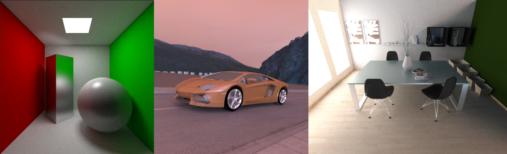

# graphics-ray-tracing

### Usage:
```shell
mkdir build
cd build
cmake ..
make

# Run: ./src/ray-tracing <scene_name>
# scene_name can be (1)cornellbox, (2)car, (3)diningroom.
# example
./src/ray-tracing cornellbox
```


### Result:


